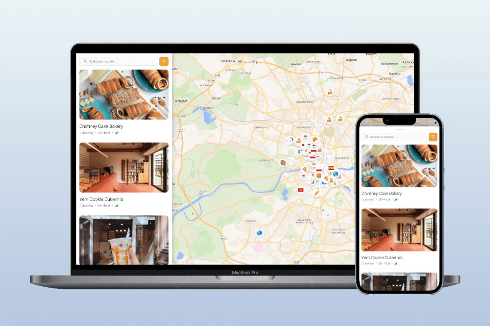

# Food Explore

## Project Purpose

**Food Explore** is a web application created as part of a master's thesis project. The goal of the thesis was to evaluate the effectiveness and usability of **recommender systems** in the context of restaurant suggestions in large cities. As part of the research, this application was developed to serve as a research tool.

The app features an interactive survey that collects users' preferences and uses them to generate personalized restaurant recommendations.

<p align="center">
  
  <br/>
  <small>Food Explore – personalized restaurant recommendation tool</small>
</p>

> _The thesis aims to investigate the effectiveness and usability of recommender systems for restaurant selection in metropolitan areas. The application serves as a tool that gathers user preferences through a guided survey and provides tailored dining suggestions._

---

## Tech Stack

- **Framework:** Next.js 15
- **Language:** TypeScript
- **Styling:** Tailwind CSS
- **State Management:** Redux Toolkit
- **Map Integration:** Mapbox GL, Maplibre GL, React Map GL
- **UI & UX:** React Modal Sheet, React Virtuoso, React Icons
- **Content Management:** Contentful

---

## Live Demo

You can try the app here: [https://foodexplore.vercel.app/](https://foodexplore.vercel.app/)

---

## How to Run Locally?

### 1. Clone the Repository:

```bash
git clone https://github.com/your-username/food-explore.git
```

### 2. Install Dependencies:

```bash
npm install
```

or:

```bash
yarn install
```

### 3. Configure Environment Variables:

Create a `.env.local` file in the root of the project and add the following:

```env
NEXT_PUBLIC_CONTENTFUL_SPACE_ID=your_space_id
NEXT_PUBLIC_CONTENTFUL_ACCESS_TOKEN=your_access_token
```

### 4. Run the Development Server:

```bash
npm run dev
```

or:

```bash
yarn dev
```

### 5. Open in Your Browser:

Visit [http://localhost:3000](http://localhost:3000) to see the app in action.

---

## Folder Structure

```bash
├── README.md
├── eslint.config.mjs
├── next-env.d.ts
├── next.config.ts
├── node_modules/
├── package-lock.json
├── package.json
├── postcss.config.mjs
├── public/
│ └── assets/
├── src/
│ ├── app/
│ ├── hooks/
│ ├── providers/
│ └── redux/
├── tailwind.config.ts
└── tsconfig.json
```

The main application logic is inside the `src/` folder. Static files such as images or icons are located in `public/assets/`.

---

## Learn More

To learn more about the tools and frameworks used in this project:

- [Next.js Documentation](https://nextjs.org/docs)
- [Tailwind CSS Documentation](https://tailwindcss.com/docs)
- [Redux Toolkit](https://redux-toolkit.js.org/)
- [Contentful Documentation](https://www.contentful.com/developers/docs/)

---

## License

This project is for educational and research purposes only and is not intended for commercial use.

---

_Developed with ❤️ for academic research._
